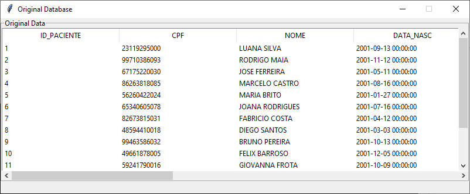
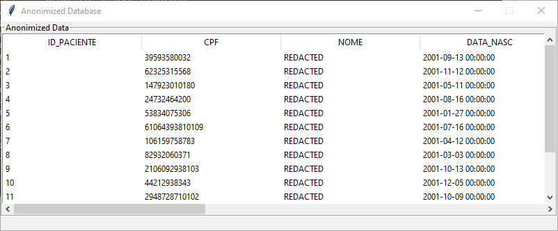

# SSC0904
Projeto final da disciplina **__SSC0904 - Sistemas Computacionais Distribuídos__** ministrada pelo **__Instituto de Ciências Matemáticas e de Computação__**, da **__Universidade de São Paulo__**, durante o segundo semestre de 2021. A proposta é criar uma implementação de anonimização de dados pessoais de pacientes de um hospital.

A solução foi imaginada tendo em mente uma possível solução para o vazamento de dados pessoais no contexto da **__Lei Geral de Dados Pessoais__** (LGPD). A anonimização foi escolhida como método pois torna impossível identificar uma pessoa a partir do dado disponível, já que uma vez anonimizado este perde definitivamente a possibilidade de identificar uma pessoa natural.

A aplicação foi proposta quando durante pesquisas sobre a **__General Data Protection Regulation__** (GDPR) chegamos ao caso da [Vastaamo](https://www.lexology.com/library/detail.aspx?g=ae4fd6ac-461f-466a-bc7f-0429f71ebbf7), uma clínica de psicoterapia finlandesa que teve sua base de dados de pacientes roubada em Outubro de 2020.


## Pré-requisitos

Para efetuar a conexão da aplicação ao sistema de gerenciamento banco de dados (SGBD), é necessário instalar o [Oracle Instant Cliente](https://www.oracle.com/br/database/technologies/instant-client/winx64-64-downloads.html).
Além disso é necessário instalar algumas bibliotecas, os comandos para a instalação são:

```
pip install cx_Oracle
pip install tkinter
pip install pandas
```

## Conectando ao SGBD
Para a conexão da aplicação com o SGBD, crie um arquivo chamado **__sqlConnection.py__**, que deverá conter o código abaixo:

```python

import cx_Oracle

"""
Configurando os parâmetros da conexão
"""
# Diretorio onde está o instantclient
cx_Oracle.init_oracle_client(lib_dir=r"ENDEREÇO DO INSTANT CLIENTE NO SEU PC")

# Configurações do servidor
ip = 'IP DA SUA CONEXÃO'
port = 'PORTA DA SUA CONEXÃO'
SID = 'SID DA SUA CONEXÃO'
dsn_tns = cx_Oracle.makedsn(ip, port, SID)

# Configurações do usuário
username = 'SEU_USUARIO'
password = 'SUA_SENHA'

def connect():
    try:
        conn = cx_Oracle.connect(username, password, dsn_tns)
    except Exception as err:
        print('Erro ao estabelecer a conexão ', err)
    else:
        print(conn.version)
        print('Conexão Estabelecida')
    
    return conn
```
Para o código funcionar é necessário substituir 'SEU_USUARIO' e 'SUA_SENHA' pelo dados da sua conexão Oracle. Vale ressaltar que é necessário também substituir "ENDEREÇO DO INSTANT CLIENTE NO SEU PC" pelo endereço em que foi instalado o instantclient, além de incluir este diretório nas variantes de ambiente "Path" do computador.

## A aplicação

O desenvolvimento foi feito com base no banco de dados de pacientes de um hospital fictício. Nela o registro dos pacientes contem dados sensíveis como nome completo, CPF, telefone e endereço.


Bom, a LGPD recomenda que seja aplicada a anonimização quando da eliminação de dados que não tenham mais utilidade ao tratamento do paciente. Nesse caso, anonimizamos os dados para o caso de estes serem úteis na realização de estudos estatísticos e os salvamos em um arquivo json.


Para tanto, removemos todos os dados sensíveis do banco que dados (que poderiam ser usados para identificar os indivíduos), são eles: o **__CPF__** (que foi substituído por um número gerado aleatoriamente), o **__nome__**, o **__endereço__**, o **__telefone__**, e a **__ocupação__** (todos estes substituídos pela palavra chave **__REDACTED__** ). Abaixo é possível ver o dataframe com os dados originais e com os dados anonimizados:

- **__Dataframe original__**


- **__Dataframe anonimizado__**


Note que o dataframe original foi apenas utilizado para ilustrar a solução, no caso de utilização real da aplicação essa informação é destruída logo que a anonimização é feita.
Para concluir o processo e torná-lo irreversível (o que é condição primordial para que possamos dizer que houve anonimização de fato), destruímos os registros do banco de dados original.

- **__Banco de dados após a finalização da execução__**

